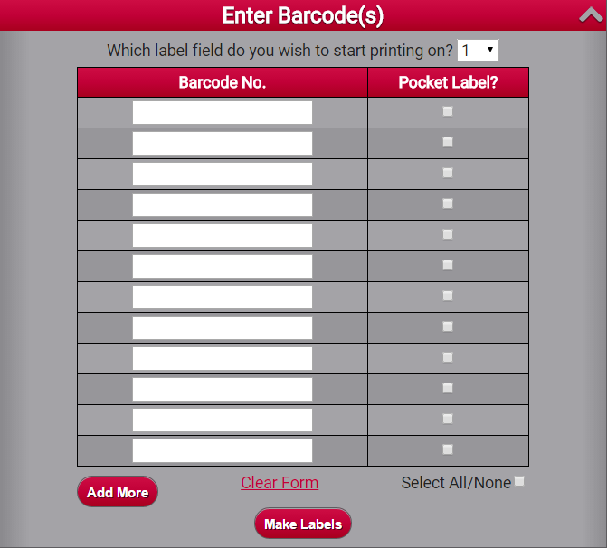
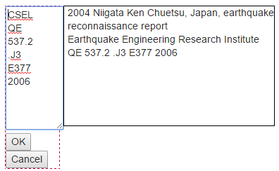

#WMS-Labeling

Custom application to add label printing capabilities to OCLC's WMS system. This application is powered by PHP, HTML, and JavaScript. It is entirely self-contained in one folder and can be installed on an existing web server or a new one.

Some core functionality provided in the 'quicklabels.php' file was provided by David Cunningham, University of New Brunswick Libraries



##Request a WSKey

This web application uses a WSKey from OCLC in order to authenticate your connection. Read about how to [request a WSKey here][1].

On the "Request a WSKey" page, here are the settings you need to utilize this application:


* **Environment:** Production
* **Services:** Check "WMS Collection Management API" and "WorldCat Search API"
* **What is the reason for this request?** To use the University of New Mexico's custom labeling application
* **Redirect URI:** Leave blank
* **Usage:** Check "I am an OCLC Partner accessing data on behalf of libraries"


##Installation

NOTE: The latest version of the code requires PHP 5.6. Older versions of PHP are no longer support per [http://php.net/supported-versions.php]

Clone this repository into your web directory ("git clone {url} labeling") or download directly from GitHub.

Change into the labeling directory

Run composer install from the command line 

Copy config/config.php.template to config/config.php. Open config/config.php and add your [OCLC WSKey][3] credentials. Set your ```base_url``` to match your folder or leave blank if your site will be the root folder.

Copy config/crosswalks.php.example to config/crosswalks.php. Open config/crosswalks.php to map shelving locations to desired call number prefixes (e.g., Reference should print as REF on your label).

Copy scripts/laser.config.sample.php to any scripts/{name}.config.php (Default: laser.config.php). Edit desired margins/spacing and settings for your label printer stock. **Note:** If you add label style
files aside from "laser.config.php", you will need to add extra radio inputs in inc/fetch_labels.php. Search for ```<div class="print-area">``` and add to the inputs below it.

##Setup

###config.php

After you get your WSKey, you'll need to go back to [WSKey Management][4], browse to "WsKey" on the left sidebar, and click on your listed WSKey to display all your information. This page will contain all the information you need for config.php.

###crosswalks.php

The crosswalks array is utilized in order to take various codes/wording from WMS and translate them to building locations and other specifics.

###laser.config.php

Edit this file to create the layout of your label stock. We used a ruler with millimeters to measure the layout of our label sheets. This config file will most likely need many test prints and tweaks before you get it right.

##Printing
###Print/edit a single label

Launch yoursite.com/labeling and scan in a barcode and indicate whether a pocket label is desired. Click the "Make Labels" button.

In the preview screen, click anywhere on the call number to edit it if needed. Make your changes and click OK.



Select "Laser Printer" or any other config that you've added. Click "Print Labels". A PDF will be generated. Press Ctrl + P to send the PDF to your printer.

###Print labels in a batch

After scanning a barcode, hit Enter on your keyboard, or press "Add More" button at the bottom of the screen to add multiple barcodes. The maximum labels per page is set in the config/{name}.config.php file.

[1]: http://www.oclc.org/developer/develop/authentication/how-to-request-a-wskey.en.html
[2]: http://www.tcpdf.org/installation.php  
[3]: http://oclc.org/developer/develop/authentication/how-to-request-a-wskey.en.html
[4]: https://platform.worldcat.org/wskey/
