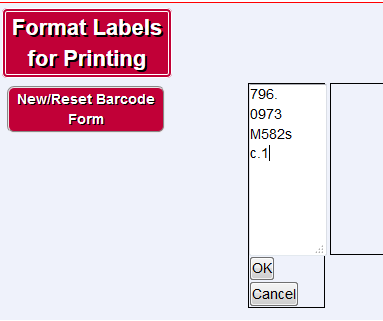

WMS-Labeling
============

Custom application to add label printing capabilities to OCLC's WMS system.

Installation
------------

git clone this repository.  Install [TCPDF][1] so that /WMS-Labeling and /tcpdf are in the same directory (e.g., if WMS-Labeling is at /www/WMS-Labeling then tcpdf should be at /www/tcpdf). and Then open config/config.php.template and add [OCLC WSKey][2] credentials and save it as config.php.  

Open config/crosswalks.php.example to map shelving locations to desired call number prefixes (e.g., Reference should print as REF on your label) and save as crosswalks.php.

Edit scripts/laser.config.sample.php to desired margins and settings for your label printer stock.

Print/edit a single label
-------------------------

Launch yoursite.com/WMS-Labeling and click 'New/Reset Barcodes'  Scan in a barcode and indicate whether a pocket label is desired.  Then click "Make Labels".

In the preview screen, click anywhere on the call number to edit it.  Make your changes and click OK.

Click "Print Labels".  A PDF will be generated.  Press Ctrl + P to send the PDF to your printer.

Print labels in a batch
-----------------------

After scanning a barcode, hit Enter on your keyboard, or press +1 at the bottom of the screen to add multiple barcodes.

When you click "Print Labels" each call number will print on a separate 'page' of the resulting PDF.

[1]: http://www.tcpdf.org/installation.php  
[2]: http://oclc.org/developer/develop/authentication/how-to-request-a-wskey.en.html
